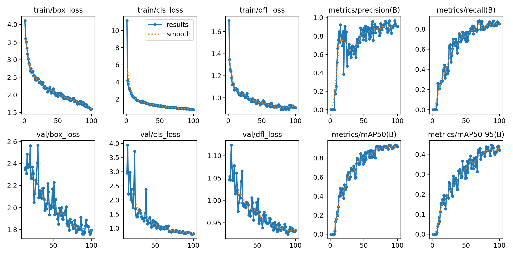
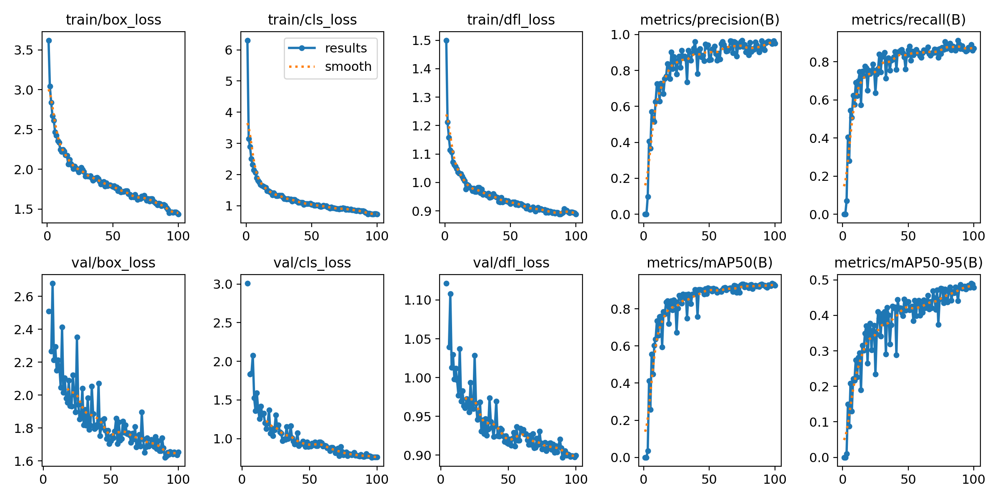
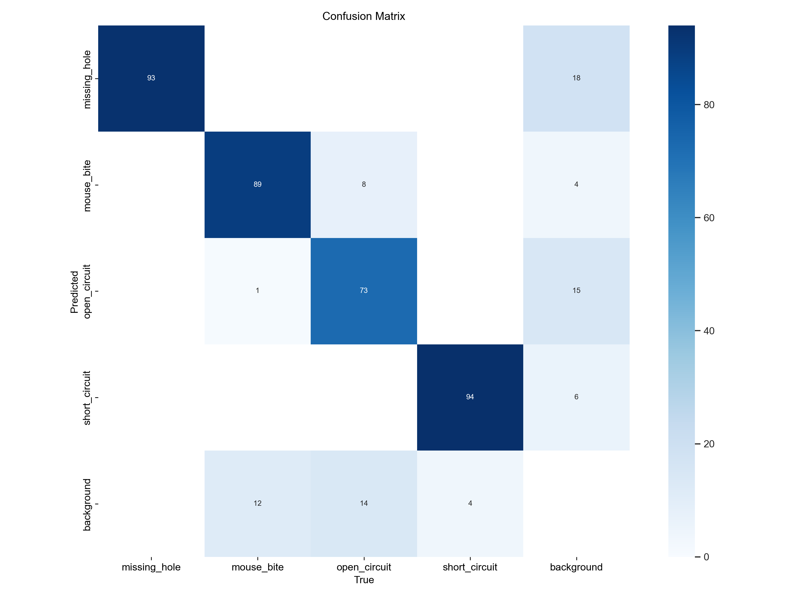
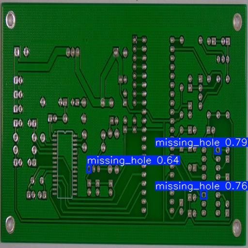
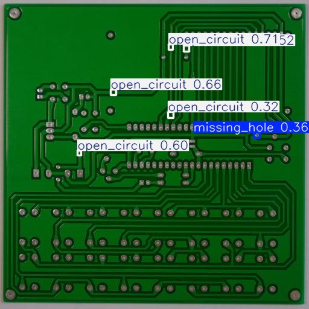
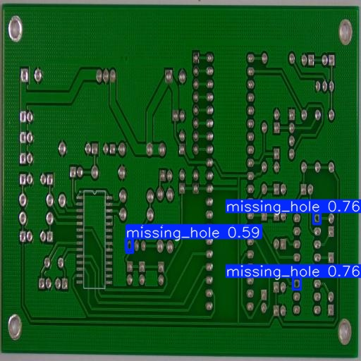
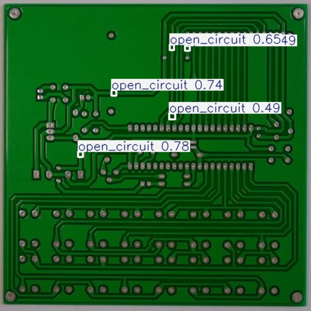

# PCB Defect Detection Using YOLOv12
**Deep Learning for Image Analysis – Midterm Project 2025**

---

## Overview
This project implements and compares two YOLOv12 object-detection pipelines for printed-circuit-board (PCB) defect identification.  
The objective is to detect four major defect types:

- Missing Hole  
- Mouse Bite  
- Open Circuit  
- Short Circuit  

Two datasets were used:

1. **Baseline Dataset** – raw images without augmentation.  
2. **Enhanced Dataset** – augmented version including brightness, contrast, flip, rotation, etc.

---

## Dataset
- **Source:** downloaded from [Kaggle](https://www.kaggle.com/datasets/akhatova/pcb-defects) and processed using **Roboflow**  
- **Format:** YOLOv12-compatible (images / labels)  
- **Resolution:** 512 × 512 pixels  
- **Splits**
  - Train    323  (baseline)  /  969  (enhanced)  
  - Validation  92  
  - Test  46  

---

## Environment
| Item | Specification |
|------|----------------|
| OS | Windows 11 |
| GPU | NVIDIA RTX 4060 Laptop GPU (8 GB VRAM) |
| Framework | PyTorch + YOLOv12 |
| Python | 3.10.19 |
| Optimizer | AdamW |
| Epochs | 100 |
| Batch Size | 16 |
| Image Size | 512 × 512 |

---

## Experiment Setup
Both models were trained using identical hyper-parameters and pretrained **YOLOv12s** weights.

| Configuration | Dataset | Augmentation | Pretrained Weights |
|----------------|----------|---------------|--------------------|
| **Baseline** | Original PCB dataset | None | YOLOv12s.pt |
| **Enhanced** | Augmented dataset | Brightness, contrast, flip, rotation, etc | YOLOv12s.pt |

Each model trained for 100 epochs and was evaluated on the same held-out test set.

---

## Results

| Model | Precision | Recall | mAP @ 0.5 | mAP @ 0.5 – 0.95 |
|--------|-----------|--------|-----------|------------------|
| **Baseline** | 0.9039 | 0.8520 | 0.9186 | 0.4203 |
| **Enhanced** | 0.9514 | 0.8710 | 0.9254 | 0.4789 |

### 1. Training and Validation Trends

**Baseline Training Curves**



**Enhanced Training Curves**



Both models show smooth convergence of box, classification, and distribution focal losses over 100 epochs.  
- The **baseline** model gradually stabilizes around epoch 80, achieving consistent improvements in mAP.  
- The **enhanced** model converges faster with slightly lower loss values, suggesting better generalization from augmented data.  
- Validation mAP@0.5–0.95 grows steadily and flattens near the end of training without divergence, indicating no overfitting.

---

### 2. Confusion Matrix Analysis

**Baseline Model**


**Enhanced Model**



- Both models perform strongly on **short circuit** and **missing hole**, exceeding 90% true-positive accuracy.  
- The **enhanced model** reduces confusion between *open circuit* and *mouse bite* classes, which were the main misclassification sources in the baseline.  
- Some false positives still appear where background solder pads or silkscreen patterns resemble defects.

---

### 3. Qualitative Results

**Baseline Predictions**

| Missing Hole | Open Circuit |
|---------------|---------------|
|  |  |

**Enhanced Predictions**

| Missing Hole | Open Circuit |
|---------------|---------------|
|  |  |

- The **enhanced model** shows clearer and more confident detections, particularly under varied lighting or orientation.  
- Bounding boxes are tighter and more accurate around defect edges, while the baseline occasionally misses small *open circuits*.  
- Confidence scores increase by roughly 0.1–0.15 on average for the same defect samples.

---

### 4. Comparative Discussion
- **Generalization:** Augmentation improves robustness to lighting, rotation, and scale variance, reflected in smoother loss curves and better recall.  
- **Localization:** Higher mAP@0.5–0.95 (+5.9%) indicates the enhanced model localizes defects more precisely.  
- **Class-Level Performance:** The biggest gain is for *open circuit* detection, where visual texture variations benefited from contrast and flip augmentation.  
- **Failure Cases:** Small or overlapping *short circuits* near IC pins remain challenging. Some false detections arise from shiny solder joints mimicking “mouse bites.”  

---

## Repository Structure
```text
PCB_DEFECTS/
├── code/
│   ├── eval_metrics.py
│   ├── infer.py
│   ├── requirements.txt
│   └── train.py
│
├── configs/
│   ├── yolov12_baseline.yaml
│   └── yolov12_enhanced.yaml
│
├── dataset/
│   ├── Baseline/
│   │   ├── train/
│   │   ├── valid/
│   │   ├── test/
│   │   └── data.yaml
│   └── Enhanced/
│       ├── train/
│       ├── valid/
│       ├── test/
│       └── data.yaml
│
├── metrics/
│   ├── baseline/
│   └── enhanced/
│
├── outputs/
│   ├── baseline/
│   │   ├── results.png
│   │   ├── confusion_matrix.png
│   │   └── sample_predictions/
│   └── enhanced/
│       ├── results.png
│       ├── confusion_matrix.png
│       └── sample_predictions/
│
├── runs/
│   ├── baseline/
│   └── enhanced/
│
├── yolov12n.pt
├── yolov12s.pt
└── README.md
````

---

## Key Findings

* Data augmentation significantly enhanced precision and localization performance.
* YOLOv12 achieved stable convergence without overfitting across 100 epochs.
* Enhanced model is more reliable for real-time PCB quality inspection, showing fewer false alarms on reflective or rotated boards.
* This workflow demonstrates an efficient and reproducible deep-learning pipeline for automated defect detection in manufacturing environments.

---
